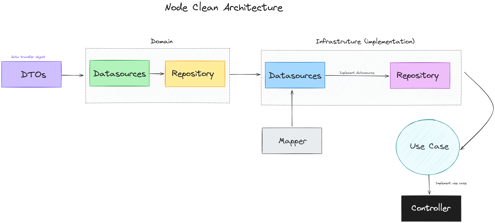

# Node Clean Architecture Example

This project demonstrates an implementation of Clean Architecture in a Node.js application. Clean Architecture helps to keep the codebase maintainable, testable, and scalable by separating the application logic into distinct layers with clear responsibilities.

## Architecture Overview



### Layers and Components

1. **DTOs (Data Transfer Objects)**:

   - These are simple objects that carry data between layers to reduce the number of method calls.

2. **Datasources (Domain)**:

   - This layer defines the interfaces for the data sources. It abstracts the implementation details of data access, making the domain logic agnostic to how and where data is stored.

3. **Repository (Domain)**:

   - The repository layer handles the data operations and contains business logic to interact with the datasources.

4. **Datasources (Infrastructure)**:

   - This layer implements the datasource interfaces defined in the domain layer. It includes the actual data access code (e.g., database queries).

5. **Repository (Infrastructure)**:

   - The repository layer in the infrastructure implements the repository interfaces from the domain layer, providing concrete data access operations.

6. **Mapper**:

   - This component is responsible for mapping data between different layers, ensuring that the data structures match the expected formats.

7. **Use Case**:

   - The use case layer contains the application-specific business rules. It orchestrates the flow of data to and from the entities, repositories, and other components.

8. **Controller**:
   - The controller layer handles the HTTP requests and responses. It interacts with the use cases to execute application logic and return the results.

## How It Works

1. **Request Flow**:

   - The client sends a request to the controller.
   - The controller invokes the appropriate use case.
   - The use case interacts with the repository to fetch or manipulate data.
   - The repository uses the datasource implementations to access the actual data storage.
   - The mapper converts the data between different layers as needed.
   - The response is sent back to the client.

2. **Benefits**:
   - **Separation of Concerns**: Each layer has a clear responsibility, making the code easier to manage and understand.
   - **Testability**: The architecture allows for isolated testing of each layer.
   - **Maintainability**: The separation of layers and adherence to interfaces make the codebase easier to maintain and extend.

## Getting Started

To get started with this project, clone the repository and follow the instructions in the `README` to set up the development environment.

```bash
git clone https://github.com/yourusername/node-clean-architecture-example.git
cd node-clean-architecture-example
npm install
npm start
```
